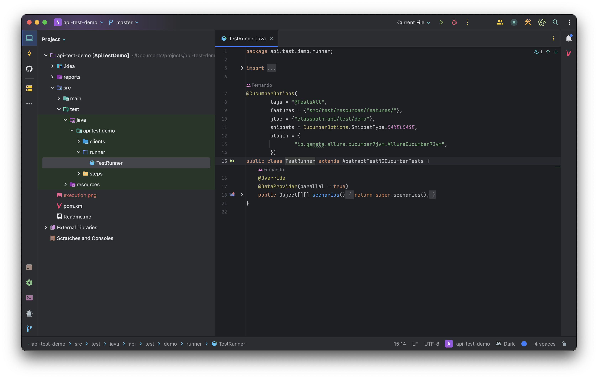

# api-test-demo

O Tamplete utilizando Java, Cucumber, TestNG, RestAssured, Allure e Faker para realizar testes de API de forma simples.

## Pré-requisitos

- Java JDK 20
- IntelliJ

## Execução

Executando a classe Runner.

